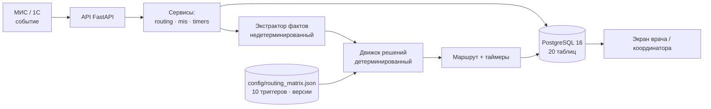

# patient-router

Матрица маршрутизации теперь включает 36 находок медицинского специалиста и 7 дополнительных проектных правил. Источники, импорт и ограничения описаны в [документации](docs/routing-matrix.md).

**СМ-Клиника «Не потерять пациента»** — сервис, который находит в подписанном
протоколе УЗИ клинически значимую находку, детерминированно решает по
настраиваемой матрице, создаёт маршрут пациента и не даёт ему исчезнуть ни на
одном переходе: уведомление → запись к профильному специалисту → приём →
врачебное решение → госпитализация → операция → контроль.

Система **не ставит диагноз и не назначает лечение**. Она ведёт маршрут.
Фактическую тактику выбирает врач (`POST /api/v1/routes/{route_id}/tactics`),
и без выбранной тактики маршрут не закрывается: из `decision_pending` переход
в закрытие без тактики отвечает 422 `TACTICS_REQUIRED`. Контроль без тактики
(`followup_done`), отказ пациента до приёма, недостижимый маршрут и отмена
протокола закрываются как обычно — там решения врача по смыслу нет.

---

## 1. Архитектура одним взглядом



| Слой | Файлы | Состояние |
|---|---|---|
| API | `app/api/` — 6 роутеров | реализованы |
| Сервисы | `app/services/` — routing, mis, timers, quality, decision | реализованы |
| Домен | `app/models.py` — 20 сущностей, 5 enum | реализованы |
| Инфраструктура | `app/db.py`, Alembic (2 миграции), Docker | реализованы |
| Экстрактор фактов | `app/services/extraction/` | **словарная заглушка**, LLM подключает сокомандник |
| UI | Jinja2 в зависимостях | не реализован |

### Ключевое решение: факты отдельно от решения

Архитектура намеренно делит работу над протоколом на две части с разными
требованиями к воспроизводимости:

**Извлечение фактов — недетерминированно.** `ProtocolExtractor.extract()`
(`app/services/extraction/base.py`) превращает текст в находки, размеры,
отрицания и цитаты. Такой шаг допускает эвристики, статистику, а позже LLM:
его результат зависит от реализации декодера.

**Решение о маршруте — детерминированно.** `DecisionEngine`
(`app/services/decision/engine.py`) проверяет каждый триггер из
`config/routing_matrix.json` по фиксированному порядку: тип исследования →
синоним → отрицательный контекст → числовые пороги. Один и тот же набор
фактов и одна и та же версия матрицы всегда дают одно и то же решение.

Почему разделение принципиально:

- **Воспроизводимость.** Решение нельзя «передумать» при повторном запуске.
  Повторный разбор того же протокола даёт тот же маршрут.
- **Объяснимость.** Ответ содержит цитату, применённое правило
  (`endometrial_polyp@v1`) и причину — как для сработавших триггеров, так и
  для подавленных. Врач видит «порог 10 мм, найдено 8 мм», а не «модель
  решила так».
- **Версионируемость правил.** Матрица — данные, а не код. Заказчик может
  изменить порог или добавить триггер без правки Python; номер редакции
  попадает в каждое объяснение.
- **Безопасность.** Экстрактор читает текст. Он не может назначить лечение
  или поставить диагноз — решение принимает проверенный врачом код. LLM
  физически не участвует в выборе тактики.

### Модельное время

`app/clock.py` даёт единый источник времени. При `USE_MODEL_CLOCK=true`
`ModelClock.advance(720)` переводит время на 30 суток мгновенно и
возвращает сработавшие таймеры. Это позволяет показать недельный сценарий
за секунды, не выдавая симуляцию за реальность: демо-эндпоинты отделены в
префикс `/api/v1/demo`.

---

## 2. Стек

| Слой | Технология |
|---|---|
| API | FastAPI + Pydantic v2 |
| ORM / миграции | SQLAlchemy 2.0 (async) + Alembic |
| БД | PostgreSQL 16 |
| Шаблоны | Jinja2 |
| Логирование | structlog |
| Зависимости | uv, `uv.lock` в репозитории |
| Контейнеры | Docker + Docker Compose |

---

## 3. Быстрый старт

Команды сверены с `Makefile`, `docker-compose.yaml`, `Dockerfile` и `.env.example`.

### Вариант A: всё в Docker

```bash
cp .env.example .env          # обязательно: проверьте свободные порты перед запуском
docker compose up -d --build  # поднимет db + app
docker compose exec -T app alembic upgrade head
```

> Сервисы `app` и `demo` выполняют `alembic upgrade head` перед запуском
> приложения. Команда выше повторяет миграции безопасно; при ошибке миграций
> приложение не запускается.

### Демо для жюри: запуск и загрузка данных

```bash
# Если .env ещё нет: cp .env.example .env; выберите свободные порты.
docker compose --profile demo up -d --build --wait demo

# Передать подготовленные синтетические протоколы из data/demo/protocols.
docker compose exec -T --user root demo mkdir -p /app/data
docker compose cp ./data/demo demo:/app/data/demo
docker compose exec -T --user root demo chown -R appuser:appuser /app/data
docker compose exec -T demo python scripts/seed_demo.py
```

Засев выполняется после готовности сервиса и миграций; повторный запуск
не создаёт дубликатов. Каталог `data/demo` должен быть подготовлен заранее
(см. раздел «Засев демо-данных для метрик качества»): он не включён в образ.
Модельное время включено жёстко в compose-файле, `sudo -E` для него не нужен.
Порты задаются явно в `.env` или окружении; пустые и отсутствующие значения
Compose отклоняет ещё до обращения к Docker. Нужны все четыре переменные
портов, включая сервисы вне выбранного профиля.

При портах из `.env.example` демо доступно на **http://localhost:8010**
(свой порт, чтобы не драться с `app` на 8000). Если порты изменены,
подставьте выбранный `DEMO_PORT` в адреса ниже:

```bash
curl localhost:8010/health
# 30 суток модельного времени за одну секунду
curl -X POST localhost:8010/api/v1/demo/clock/advance \
  -H 'Content-Type: application/json' -d '{"days": 30}'
curl localhost:8010/api/v1/demo/scenarios
```

| Сервис | Порт | USE_MODEL_CLOCK | Когда поднимается |
|---|---|---|---|
| `app` | 8000 | `${USE_MODEL_CLOCK:-false}` — боевое время | `docker compose up` |
| `demo` | 8010 | `"true"` жёстко — модельное время | `--profile demo` |
| `dev` | 8001 | `${USE_MODEL_CLOCK:-true}` + hot reload | `--profile dev` |

Порты в таблице — значения из `.env.example`, а не дефолты Compose.
Сервисы `app` и `demo` сами выполняют `alembic upgrade head` при старте;
для `dev` миграции нужно применить отдельно.

> [!important] Почему раньше требовался `sudo -E`
> `sudo` по умолчанию сбрасывает переменные окружения (`env_reset`), поэтому
> на машине жюри подстановка `${USE_MODEL_CLOCK:-false}` всегда давала `false`,
> и `/api/v1/demo/clock/advance` отвечал `409 CLOCK_NOT_MOCK`. Сервис `demo`
> снимает зависимость от окружения хоста: значение задано в файле.

### Вариант B: локально без Docker для приложения

```bash
cp .env.example .env          # если .env ещё нет; выберите свободные порты
uv sync --frozen --all-extras   # зависимости из uv.lock
docker compose up -d db         # только БД на localhost:5433
uv run alembic upgrade head     # создать схему
uv run uvicorn app.main:app --reload
```

Демо-сценарии с прокруткой времени локально:

```bash
USE_MODEL_CLOCK=true uv run uvicorn app.main:app --reload
# или весь стек с hot reload (порт 8001, модельное время включено):
docker compose --profile dev up dev
```

### Имена контейнеров и тома

В compose нет `container_name` и нет `name:` у тома. Compose сам называет
контейнеры `<проект>-<сервис>-1`, а том — `<проект>_pgdata`. Это не стилистика:
хардкод ронял стенд при любой второй копии каталога или соседнем проекте на
той же машине (`Conflict. The container name "/pr-db" is already in use`).

### Если стенд не поднимается

Проверьте владельца портов, не останавливая чужие контейнеры:

```bash
ss -ltnp '( sport = :8010 or sport = :5433 )'
docker ps --format 'table {{.Names}}\t{{.Ports}}'
docker compose --profile demo ps -a
cid=$(docker compose --profile demo ps -a -q demo)
[ -z "$cid" ] || docker inspect "$cid" --format '{{json .State}}'
docker compose logs --tail=100 demo db
```

При конфликте портов `up` сразу сообщает `port is already allocated`,
а `.State.Error` сохраняет причину ошибки запуска. У сервисов с публикуемыми портами отключён
автоматический рестарт: ошибка не превращается в цикл с потерянной сетью.
Ошибка миграций видна в логах и коде завершения. `/health` проверяет процесс,
`/ready` проверяет БД и все таблицы/колонки приложения; healthcheck демо
использует `/ready`, поэтому `--wait` не подтверждает пустую схему.

Второй демо-стенд поднимайте с отдельным именем проекта и свободными портами:

```bash
POSTGRES_PORT=5434 APP_PORT=8002 DEV_PORT=8003 DEMO_PORT=8012 \
  docker compose -p stand-b --profile demo up -d --build --wait demo
curl -f http://localhost:8012/ready
```

Имя проекта разделяет контейнеры, сеть и том, но не резервирует порты.
Если выбранные порты заняты, выберите другие; чужие стенды не удаляйте.

Регрессия закрыта тестом `tests/unit/test_compose.py`: он падает, если
`container_name`, `name:` у тома или молчаливые дефолты портов вернутся.

## Засев демо-данных для метрик качества

Для воспроизведения честных метрик качества без доступа к реальным данным.
Это отдельная задача от демо-сервиса `demo` выше: здесь нужен разобранный
проект под рукой, а не контейнер с модельным часом.

```bash
# 1. Поднять только БД (любой PostgreSQL 16)
docker compose up -d db

# 2. Накатить миграции
uv run alembic upgrade head

# 3. Засеять демо-данные (создаёт Patient/Study/Protocol + study_index.json)
uv run python scripts/seed_demo.py

# 4. Запустить приложение
uv run uvicorn app.main:app --reload
```

Теперь эндпоинт метрик доступен:

```bash
# Честные метрики по золотой выборке (204 образца, 79 исследований)
curl "http://localhost:8000/api/v1/quality/metrics?split=gold"
```

Ожидаемый формат ответа (цифры могут отличаться в зависимости от версии декодера):
```json
{
  "tp": 8,
  "fp": 0,
  "fn": 37,
  "tn": 159,
  "recall": 0.1778,
  "precision": 1.0,
  "fpr": 0.0,
  "f1": 0.3019,
  "n_samples": 204,
  "split": "gold"
}
```

**Что делает `seed_demo.py`:**
- Читает 89 синтетических протоколов из `data/demo/protocols/*.txt`
- Создаёт для каждого: `Patient` (по номеру карты), `Study` (с UUID), `Protocol`
- Пишет `data/demo/study_index.json` — маппинг `demo_abdomen_01` -> UUID исследования
- Идемпотентно: повторный запуск не дублирует записи (детерминированные UUID)

**Почему так:**
- Разметка `data/labeled/labeled.json` остаётся читаемой (идентификаторы `demo_*`)
- `study_index.json` -- генерируемый артефакт, привязанный к конкретной БД
- Эндпоинт `/api/v1/quality/metrics` резолвит `demo_*` -> UUID через индекс, потом ходит в БД за протоколами
- Никакой подгонки цифр: метрики честны, как есть у текущего декодера


## Документация

### Проверка


```bash
curl localhost:8000/health    # живость приложения
curl localhost:8000/ready     # готовность БД и схемы
```

Swagger: <http://localhost:8000/docs>. Порты по умолчанию: приложение — `8000`,
БД — `5433`.

> [!important] Ограничение Docker-образа
> Текущий `Dockerfile` копирует `app`, `alembic` и `alembic.ini`, но **не**
> копирует и Compose не монтирует `config/`. Чтобы правила загрузились в
> контейнере, добавьте в `docker-compose.yaml` volumes для сервиса `app`:
> `- ./config:/app/config:ro`.

### Полезные команды

```bash
make help          # список целей
make up            # docker compose up -d --build
make migrate       # uv run alembic upgrade head
make migrate-check # uv run alembic check
make lint          # ruff format --check + ruff check
make typecheck     # mypy app
make check         # lint + test (то же, что делает CI локально)
```

---

## 4. Эндпоинты

Сверено с `app/main.py`: подключены шесть роутеров.

### Служебные

| Метод | Путь | Назначение |
|---|---|---|
| GET | `/health` | Живость процесса, время, режим часов |
| GET | `/ready` | БД и таблицы/колонки схемы; 503 при сбое |
| GET | `/docs` | Swagger UI (каркас FastAPI) |
| GET | `/openapi.json` | Спецификация (каркас FastAPI) |

### Анализ — `app/api/analysis.py`

| Метод | Путь | Назначение |
|---|---|---|
| POST | `/api/v1/analyze` | Разобрать протокол, вернуть находки и решение с объяснением. Не меняет состояние |
| POST | `/api/v1/analyze/upload` | То же файлом `.docx` или `.txt` |

### Маршруты — `app/api/routes.py`

| Метод | Путь | Назначение |
|---|---|---|
| POST | `/api/v1/routes` | Создать маршрут и таймеры из срабатывания |
| GET | `/api/v1/routes` | Очередь: фильтры `status`, `specialty`, `clinic`, `overdue`, `patient_id` |
| GET | `/api/v1/routes/unfinished` | Незакрытые маршруты пациента (источник баннера) |
| GET | `/api/v1/routes/{route_id}` | Карточка: маршрут, таймеры, последние 10 этапов |
| GET | `/api/v1/routes/{route_id}/timeline` | Полная история этапов и записи аудита |
| POST | `/api/v1/routes/{route_id}/tactics` | Записать тактику врача; без неё маршрут не закрыть |
| POST | `/api/v1/routes/{route_id}/transition` | Перевод по правилам конечного автомата |

### События МИС — `app/api/mis.py`

| Метод | Путь | Назначение |
|---|---|---|
| POST | `/api/v1/mis/events` | Принять событие идемпотентно; 202, для дубля — 200, для занятого `event_id` с другим содержимым — 409 |
| GET | `/api/v1/mis/events` | Журнал событий; фильтры `event_type`, `processed` |
| GET | `/api/v1/mis/event-types` | Справочник 12 поддерживаемых типов |

### Оценка качества — `app/api/quality.py`

| Метод | Путь | Назначение |
|---|---|---|
| GET | `/api/v1/quality/metrics` | `recall`, `precision`, `fpr`, `f1`, матрица ошибок; `split=gold\|synthetic\|all` |
| GET | `/api/v1/quality/confusion` | Только `tp`, `fp`, `fn`, `tn` |
| GET | `/api/v1/quality/errors` | Расхождения FP и FN с цитатами и правилом |
| GET | `/api/v1/quality/coverage` | Покрытие триггеров разметкой; БД не требуется, без разметки — `available: false` |

### Демо — `app/api/demo.py`

| Метод | Путь | Назначение |
|---|---|---|
| GET | `/api/v1/demo/clock` | Текущее модельное время и источник |
| POST | `/api/v1/demo/clock/advance` | Сдвинуть часы на `hours` или `days` и выполнить таймеры |
| POST | `/api/v1/demo/clock/set` | Перейти к моменту сценария; откат запрещён |
| POST | `/api/v1/demo/clock/reset` | Вернуться к старту демо |
| GET | `/api/v1/demo/timers` | Запланированные таймеры маршрута; БД обязательна |
| GET | `/api/v1/demo/scenarios` | Каталог 7 сценариев защиты |

Примеры:

```http
POST /api/v1/analyze
Content-Type: application/json

{
  "text": "ЗАКЛЮЧЕНИЕ: Эхографические признаки полипа эндометрия, 12 мм. Рекомендовано: консультация гинеколога.",
  "study_type": "УЗИ органов малого таза"
}
```

```json
{
  "study_type": "УЗИ органов малого таза",
  "extractor": "DictionaryExtractor(59 синонимов)",
  "conclusion_extracted": false,
  "findings": [
    {
      "finding": "Полип эндометрия",
      "size_mm": 12.0,
      "quote": "полипа эндометрия",
      "char_start": 36,
      "char_end": 53,
      "in_negative_context": false,
      "confidence": 1.0
    }
  ],
  "matches": [
    {
      "trigger_id": "endometrial_polyp",
      "fired": true,
      "suppressed": false,
      "suppression_reason": null,
      "applied_rule": "endometrial_polyp@v1",
      "detail": "находка найдена, отрицания нет, порог выполнен",
      "version": 1
    },
    {
      "trigger_id": "submucosal_fibroid",
      "fired": false,
      "suppressed": false,
      "suppression_reason": "no_match",
      "detail": "ни один синоним не встретился в тексте",
      "applied_rule": "submucosal_fibroid@v1",
      "version": 1
    }
  ],
  "route_would_be_created": true,
  "winning_trigger": "Полип эндометрия",
  "specialty": "Оперирующий гинеколог",
  "target_sla_days": 7,
  "is_emergency": false,
  "triggered_count": 1,
  "suppressed_count": 9
}
```

`matches` содержит решения по **всем** десяти триггерам — включая те, что не
сработали, с причиной. Без этого нельзя измерить долю ложных срабатываний.

```http
POST /api/v1/mis/events
Content-Type: application/json

{
  "event_id": "mis-demo-signed-001",
  "event_type": "StudyProtocolSigned",
  "occurred_at": "2026-08-26T14:32:00Z",
  "subject": {
    "patient_id": "00000000-0000-4000-8000-000000000001",
    "study_id": "00000000-0000-4000-8000-000000000002"
  },
  "payload": {
    "study_type": "УЗИ органов малого таза",
    "raw_text": "Заключение: субмукозная миома 25 мм."
  }
}
```

```bash
# 30 суток модельного времени за одну секунду
curl -X POST localhost:8000/api/v1/demo/clock/advance \
  -H 'Content-Type: application/json' \
  -d '{"days": 30}'
```

Подробные контракты, коды ошибок и примеры — в [`docs/api.md`](docs/api.md).

---

## 5. Тесты

```bash
make test       # все тесты с покрытием
make test-unit  # только юнит-тесты, БД не нужна
make cov        # HTML-отчёт → htmlcov/index.html
make check      # lint + test
```

Прямой запуск без покрытия:

```bash
uv run pytest --no-cov
```

Актуальное число тестов смотрите в выводе `pytest`: набор пополняется, и
зафиксированная цифра в документации разъезжалась бы с кодом при первом же
изменении. Юнит-тесты не требуют БД.
Интеграционные тесты помечены маркером `integration` и пропускаются без
`TEST_DATABASE_URL`.

| Файл | Тестов | Что проверяет |
|---|---|---|
| `tests/unit/test_models.py` | 31 | ограничения, CHECK, enum, частичные индексы, server defaults, связи |
| `tests/unit/test_thresholds.py` | 17 | проверка всех ключей порогов, неизвестная метрика, цитаты |
| `tests/unit/test_timers.py` | 16 | расписания эскалаций, однократное срабатывание, `advance_clock` |
| `tests/unit/test_quality.py` | 21 | метрики по паре (исследование, триггер), ошибки области |
| `tests/unit/test_decision_engine.py` | 30 | порядок проверки, подавления, приоритет, экстренность |
| `tests/unit/test_extraction_contract.py` | 24 | контракт `ProtocolExtractor`, валидация цитат |
| `tests/unit/test_clock.py` | 20 | модельное время, запрет отката, singleton |
| `tests/unit/test_mis.py` | 15 | идемпотентность, 12 типов событий, отказы переходов |
| `tests/unit/test_routing.py` | 11 | конечный автомат, закрытие, тактика |
| `tests/unit/test_settings.py` | 8 | DSN (TCP и unix-сокет), окружение |
| `tests/unit/test_compose.py` | 28 | нет `container_name`/`name:` у тома, демо-сервис с модельным часом, `scripts` в обоих этапах образов |
| `tests/integration/test_analysis_api.py` | 16 | `/analyze`, `/analyze/upload` |
| `tests/integration/test_demo_api.py` | 10 | часы, сценарии, таймеры |
| `tests/integration/test_health_api.py` | 8 | `/health`, `/ready`, OpenAPI |
| `tests/integration/test_routes_api.py` | 8 | карточка маршрута, тактика, переходы |

Пропускается один тест в `test_thresholds.py`: демо-протоколы не входят в
поставку, проверка выполняется на тестовом тексте.

### Непрерывная интеграция

`.github/workflows/ci.yml` — пять проверяющих джобов и сводный `Итог`,
который падает при любом красном:

| Джоб | Что делает |
|---|---|
| `Линтинг и форматирование` | `ruff format --check`, `ruff check`, `mypy app` |
| `Тесты` | `pytest` с покрытием, `coverage.xml` артефактом |
| `Миграции` | `upgrade head` → `check` → `downgrade base` → `upgrade head` на `postgres:16` |
| `Сборка образа` | сборка и проверка ответа контейнера на `/health` |
| `E2E-smoke: БД и приложение` | `compose up` → `/ready` → миграции → `таблиц >= 20` |
| `Итог` | падает, если хоть один джоб красный |

> [!note] Честная деталь
> В джобе `Линтинг и форматирование` шаг `mypy app` помечен
> `continue-on-error: true` — ошибки типов пока не блокируют merge. Форматирование
> и линтер блокируют.

### Правило приёма кода в `main` и почему оно локальное

Цель: в `main` попадает только код, прошедший проверки. На GitHub это делает
branch protection, но включить его в этом репозитории нельзя: аккаунт
разработчика не админ, а rulesets на тарифе Free выключены (GitHub отвечает
`403 Upgrade to GitHub Pro`). Поэтому барьер сделан в двух слоях.

**Слой 1 — локальный гейт (блокирует пуш).** `.githooks/pre-push` запускает
`scripts/local_ci.sh` на том коммите, который реально уходит в `main`, и
отменяет пуш при красном результате.

```bash
make hooks   # один раз: git config core.hooksPath .githooks
make gate    # прогнать гейт вручную
make gate-fast   # без Docker: линт, типы, тесты
```

Гейт повторяет все пять проверяющих джобов CI. Отличия от CI, которые стоит
знать:

| Отличие | Почему так |
|---|---|
| `mypy` не блокирует | В CI у него `continue-on-error: true`, 108 ошибок. Строгий гейт заблокировал бы пуш навсегда |
| Миграции гоняются в схеме `ci_gate_<pid>` | Рабочая БД разработчика не страдает от `downgrade base` |
| `TEST_DATABASE_URL` не задаётся | По конвенции проекта интеграционные тесты мокают сессию БД; 527 тестов проходят без PostgreSQL |
| Без Docker шаги образа и smoke пропускаются | `docker.sock` доступен не из любого шелла; скрипт сам предупредит |

Обход намеренно оставлен видимым: `SKIP_PUSH_GATE=1 git push …`.

**Слой 2 — серверная страховка.** `.github/workflows/main-guard.yml` после
пуша в `main` собирает статусы джобов и, если что-то красное, открывает issue
с таблицей результатов и ссылками на логи. Не блокирует, но делает последствие
видимым — с branch protection это делать нечем.

> [!warning] Граница защиты
> Гейт живёт на машине разработчика. Он не защищает от пуша с чужого
> аккаунта, из другого клона или с `--no-verify`. Единственная настоящая
> защита — branch protection, и она требует прав администратора репозитория.

---

## 6. Метрики качества

```bash
curl 'localhost:8000/api/v1/quality/metrics?split=all'
curl 'localhost:8000/api/v1/quality/confusion'
curl 'localhost:8000/api/v1/quality/errors?limit=20'
curl 'localhost:8000/api/v1/quality/coverage'
```

Разметка читается из каталога `LABELED_DATA_DIR` (по умолчанию
`data/labeled/*.json`) в формате:

```json
[
  {
    "study_id": "00000000-0000-4000-8000-000000000002",
    "trigger_id": "endometrial_polyp",
    "label": true,
    "split": "gold"
  }
]
```

Метрики считаются **по паре (исследование, триггер)**, а не по одному
`trigger_id`: смешивание предсказаний разных исследований в одну оценку
приводит к исключению, а не к бессмысленным числам.

> [!important] Разметка хакатона не публикуется
> `data/labeled/` под `.gitignore`, поэтому в свежем клоне её нет, и
> `/metrics`, `/confusion`, `/errors` отвечают HTTP 503 — считать нечего.
> `/coverage` при этом работает всегда: общее число триггеров берётся из
> `config/routing_matrix.json`, а без разметки покрытие честно помечается
> `"available": false` с `covered: null` и `ratio: null`. Ноль был бы ложью,
> читающейся как «триггеры не проверялись движком».

Подробнее — в [`docs/api.md`](docs/api.md) и [`docs/routing-matrix.md`](docs/routing-matrix.md).

---

## 7. Ограничения и что не сделано

Этот раздел — часть защиты. Цифры ниже честные.

### Экстрактор — словарный, не LLM

`DictionaryExtractor` (`app/services/extraction/dictionary_extractor.py`)
ищет находки подстрокой по 59 синонимам из матрицы, берёт размер в мм из
той же строки и проверяет маркеры отрицания.

Умеет: найти находку по словарю синонимов, вытащить размер в мм, выставить
флаг отрицания.
Не умеет: понимать свободный текст, полноценную морфологию, BI-RADS и ORADS в
свободной формулировке, несколько находок одного типа.

Подключение настоящего декодера — замена одной функции: `get_extractor()` в
`app/services/extraction/__init__.py`. Контракт — `ProtocolExtractor` из
`base.py`; больше нигде менять не нужно. **Это зона ответственности
сокомандника.**

### Метрики на текущем экстракторе

| Метрика | Значение | Комментарий |
|---|---|---|
| `recall` | **≈ 0,18** | Низкий: словарь не покрывает реальные формулировки |
| `precision` | **1,00** | Всё, что сработало, было правильным |
| `fpr` | **0,00** | Ложных срабатываний на размеченных нормах нет |
| `f1` | ≈ 0,30 | Следствие низкого recall |

Чтение этих чисел: система **крайне осторожна**. Она почти не «видит»
находки, зато не создаёт лишних маршрутов — то есть не мешает врачу.
Это осознанный размен: до подключения LLM лучше не заметить находку, чем
отправить норму на лишнюю консультацию. После подключения нормального
декодера recall должен вырасти, а precision — не упасть ниже текущего
уровня.

Метрики посчитаны на размеченной выборке из данных хакатона; сами протоколы
в репозиторий не публикуются. Получить те же числа на своей машине можно
только с этой разметкой — из репозитория она не поставляется.

### Десять протоколов предстательной железы не размечены

В данных есть исследования предстательной железы, для которых **нет
триггера в матрице** и нет разметки. Система на них не сработает: нет
правила — нет решения. Это осознанное решение, а не недосмотр: формулировка
находки, порог, профиль и срок должны быть согласованы с врачом, иначе мы
добавили бы правило, мимо которого не может пройти ни один пациент.

### Что ещё не сделано

- **UI отсутствует.** Jinja2 есть в зависимостях, экранов нет. API — единственный
  способ посмотреть маршрут.
- **Авторизации нет.** Доступ к `/api/v1/*` не разграничен. Для пилота в
  контуре клиники это блокер.
- **Адаптеры МИС и доставки — заглушки.** Обработчики 12 типов событий
  реализованы с боевыми контрактами, но реального обмена с 1С и сервисом
  расписания нет.
- **Внешний провайдер доставки не подключён.** Эффект таймера доходит до
  сообщения: `deliver_effects` пишет его в `notification` (и `task` для
  координатора) в той же транзакции, что и отметку `timer.fired`, поэтому
  личный кабинет и очередь задач наполняются при прокрутке времени.
  Реальной отправки СМС/	push нет — сообщение сохраняется в БД.
  Лимиты `max_notifications_per_route=8` и
  `notification_throttle_seconds=3600` объявлены, но не применяются.
- **`config/` не попадает в Docker-образ.** Матрица не загрузится в
  контейнере, пока её явно не смонтируют (см. раздел 3).
- **Матрица не синхронизируется с БД.** `load_triggers()` читает JSON;
  таблица `trigger_def` заполняется отдельно. Hot reload отсутствует.
- **`mypy` не блокирует CI** (`continue-on-error: true`).
- **`/ready` при сбое возвращает до 200 символов текста исключения** —
  возможна утечка технических деталей.
- **Рабочие дни и календарь не учитываются.** `target_sla_days` — это дни
  от даты старта, а не производственный календарь клиники.
- **Только PostgreSQL.** `pg_advisory_xact_lock` и частичные индексы
  привязывают решение к этой СУБД.

---

## 8. Документация

| Файл | Содержание |
|---|---|
| [`docs/jury.md`](docs/jury.md) | Материалы к защите: критерии жюри, демо-сценарий, ответы на неудобные вопросы |
| [`docs/architecture.md`](docs/architecture.md) | Слои, конвейер, модельное время, идемпотентность, безопасность |
| [`docs/data-model.md`](docs/data-model.md) | 20 сущностей, ограничения, частичные индексы, enum |
| [`docs/api.md`](docs/api.md) | REST-контракты, события МИС, коды ошибок, примеры ответов |
| [`docs/routing-matrix.md`](docs/routing-matrix.md) | 10 триггеров, поля матрицы, объяснимость, добавление триггера |

---

## 9. Структура

```
app/
├── main.py                     # FastAPI: приложение, lifespan, 6 роутеров
├── api/
│   ├── health.py               # /health, /ready
│   ├── analysis.py             # /api/v1/analyze, /api/v1/analyze/upload
│   ├── routes.py               # маршруты, тактика, таймлайн
│   ├── mis.py                  # события МИС
│   ├── quality.py              # метрики на размеченных данных
│   └── demo.py                 # модельное время, таймеры, сценарии
├── services/
│   ├── decision/
│   │   ├── matrix.py           # загрузка и валидация матрицы
│   │   ├── thresholds.py       # проверка любого ключа thresholds
│   │   └── engine.py           # детерминированное решение
│   ├── extraction/             # контракт + DictionaryExtractor
│   ├── routing.py              # конечный автомат маршрута
│   ├── mis.py                  # обработка 12 типов событий
│   ├── timers.py               # расписания эскалаций и модельное время
│   └── quality.py              # метрики и разметка
├── models.py                   # 20 ORM-сущностей, 5 enum
├── clock.py                    # SystemClock / ModelClock
├── db.py                       # async-движок и фабрика сессий
└── settings.py                 # конфигурация из окружения
alembic/versions/               # 2 миграции: e18a439f9a84 → 2f8c1d4a7b93
config/routing_matrix.json      # 10 триггеров, 59 синонимов
docs/                           # документация
infra/postgres/                # эталонная схема и сиды
tests/                          # unit + integration
Dockerfile                      # образ приложения (uv.lock, --frozen)
Dockerfile.dev                  # dev-образ с hot reload
docker-compose.yaml             # db + app (+ dev и demo в профилях)
Makefile                        # команды разработки
```

---

## Лицензия и данные

Данные — обезличенные материалы хакатона, файлы протоколов в репозиторий не
публикуются. Доступа к МИС (1С) и сервису расписания нет: используются
адаптеры-заглушки с боевыми контрактами. Пилот с реальными медицинскими
данными разворачивается в контуре клиники. Документация не утверждает
соответствие прототипа требованиям законодательства о персональных данных и
врачебной тайне.
