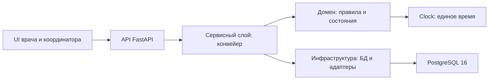
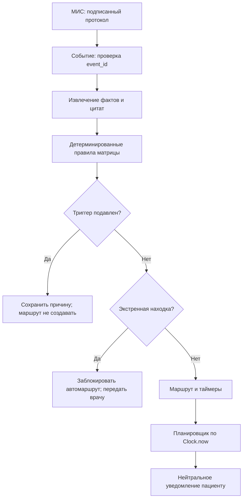
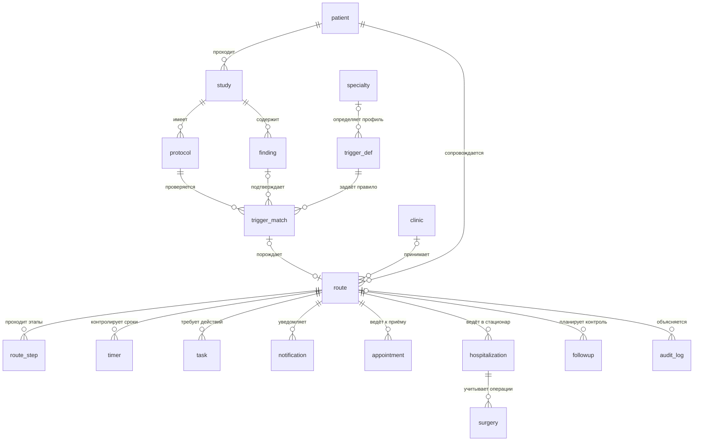

# Архитектура patient-router

patient-router сопровождает пациента после клинически значимой находки в протоколе УЗИ: уведомление → запись → приём → решение врача → госпитализация → операция → контроль. Сервис не ставит диагноз и не назначает лечение.

## Граница реализованного

В текущем репозитории реализованы 20 ORM-сущностей, миграции, источник времени, контракт извлечения, словарный экстрактор, загрузчик матрицы и служебные API `/health`, `/ready`. Конвейер маршрутизации, обработчики МИС, планировщик, уведомления и UI ниже описывают целевую архитектуру; они ещё не подключены в `app/main.py`. [Бизнес-API](api.md) также является проектным контрактом.

## Ключевое решение: факты отдельно от маршрута

Извлечение фактов допускает недетерминированность: LLM или эвристики превращают текст в находки, размеры, классификации, отрицания и цитаты. Интерфейс `ProtocolExtractor.extract()` возвращает `ExtractionResult` и не принимает решений о маршруте. Сейчас используется ограниченный `DictionaryExtractor`: поиск подстрок, отрицаний в строке и размера в миллиметрах.

Дальнейшее решение должно приниматься детерминированными правилами по сохранённым фактам и конкретной версии матрицы. Причины разделения:

- **Воспроизводимость:** одинаковые факты и версия правил дают одинаковое решение; повторное извлечение LLM само по себе этого не гарантирует.
- **Объяснимость:** врач видит цитату, измерение, порог и причину срабатывания или подавления, а не свободное рассуждение модели.
- **Версионирование:** изменение порога отделено от смены экстрактора; редакцию правила нужно сохранять в объяснении решения.
- **Безопасность:** LLM не может назначить лечение. `potential_route` — справочная возможная тактика, фактическую тактику выбирает врач.

`app/services/decision/matrix.py` пока только читает конфигурацию и выдаёт предупреждения; движка применения порогов в нём нет.

## Слои приложения

| Слой | Ответственность | Опора в репозитории / состояние |
|---|---|---|
| UI | Карточка маршрута, цитаты, причины подавления, очередь координатора, демо | Целевой слой; Jinja2 есть в зависимостях, экранов нет |
| API | Валидация входа, HTTP-контракты, разграничение доступа | FastAPI, `app/main.py`, `app/api/health.py`; бизнес-ручки планируются |
| Сервисный | Оркестрация извлечения, правил, событий, таймеров и уведомлений | `app/services/extraction/`, загрузчик `app/services/decision/matrix.py`; оркестрация планируется |
| Доменный | Находки, правила, состояния маршрута, сроки и инварианты | Dataclass-контракт извлечения, enum в `app/models.py`, интерфейс `Clock` |
| Инфраструктурный | PostgreSQL, транзакции, миграции, адаптеры МИС и доставки | SQLAlchemy async, `app/db.py`, Alembic, Docker; интеграционные адаптеры планируются |

`app/models.py` объединяет доменные перечисления и ORM-представление: это текущая организация файлов, а не физически изолированные слои.

## Конвейер от подписания до уведомления

Целевая последовательность обработки:

1. МИС подписывает протокол и доставляет `StudyProtocolSigned` с постоянным `event_id`.
2. API проверяет конверт, сохраняет `mis_event`; повторная доставка не запускает новый маршрут.
3. Обработчик связывает пациента, исследование и подписанный протокол, сохраняет исходный текст.
4. Экстрактор выделяет находки, отрицания, размеры и цитаты. Отсутствие находки не означает медицинскую норму: это может быть ограничением декодера.
5. Правила проверяют тип исследования, отрицательный контекст, достоверность и пороги матрицы. Результат сохраняется в `trigger_match`, включая подавленные совпадения.
6. Перед созданием автоматического маршрута выполняется отдельная проверка `emergency_flag`. Экстренная находка передаётся врачу/координатору по согласованному клиникой процессу.
7. Для допустимого срабатывания создаются маршрут, начальный шаг, целевая дата и таймеры. Решение и версия правила попадают в аудит.
8. Планировщик по `Clock.now()` выбирает наступившие таймеры. Перед доставкой заново проверяет актуальность маршрута, лимит сообщений и интервал между ними.
9. Адаптер отправляет нейтральное уведомление с переходом в защищённый личный кабинет; результат доставки сохраняется в `notification`.
10. События записи, приёма и лечения продвигают маршрут; таймеры создают напоминания, задачи и эскалации, если следующий шаг не состоялся.

## Модельное время — требование кейса

`Clock.now()` возвращает время с часовым поясом UTC. `SystemClock` использует время сервера. `ModelClock` хранит управляемый момент: начальное значение по умолчанию — `2026-08-26T14:32:00+00:00`. `get_clock()` выбирает единственный экземпляр по `USE_MODEL_CLOCK`; в Compose для app по умолчанию `false`, для dev — `true`.

`advance(hours)` вычисляет целевой момент, вызывает `collect_due(target)` у зарегистрированных через `register()` слушателей, собирает их результаты и затем обновляет часы. Поэтому `advance(720)` переводит время на 30 дней без реального ожидания. Шаги 24 и 72 часа, 7, 14 и 30 дней можно показать за секунды при подключённом планировщике. Это ключевое требование кейса и преимущество демонстрации перед решениями, зависящими от реального календаря; сравнение с конкретными конкурентами репозиторием не подтверждается.

Одного сдвига часов недостаточно: слушатель должен выбрать просроченные таймеры и выполнить переходы, включая новые таймеры внутри пройденного интервала. Готового слушателя в репозитории нет. Время выполнения внешних операций также не исчезает при сдвиге часов.

Доменная логика должна получать время через `Clock`, иначе часть сценария останется в реальном времени. Серверные `DEFAULT now()` в ORM и время структурных логов остаются системными: бизнес-сроки и отметки действий в демо нужно задавать явно. `set()` запрещает откат, но `advance()` пока не проверяет отрицательные часы; проектный API обязан отклонять их. `reset()` очищает слушателей; состояние часов находится в памяти процесса, не разделяется между worker-процессами и не сохраняется после перезапуска.

## Модель данных

Все таблицы ниже определены в `app/models.py`. Большинство первичных ключей — UUID с Python- и серверным значением по умолчанию; справочники используют целочисленные ключи.

| Сущность | Что хранит | Ключевые поля |
|---|---|---|
| `patient` | Пациента без ФИО в этой модели | `id`, `external_id`, `anonymized_hash`, `age`, `sex` |
| `study` | Исследование и исходный текст | `patient_id`, `study_type`, `study_date`, `raw_text`, `status` |
| `protocol` | Подписанную редакцию протокола | `study_id`, `signed_at`, `facts`, `is_corrected`, `is_cancelled` |
| `finding` | Извлечённую находку и доказательство | `study_id`, `finding`, `size_mm`, `classification`, `quote`, `char_start`, `char_end`, `in_negative_ctx` |
| `trigger_def` | Определение правила | `trigger_id`, `synonyms`, `negative_contexts`, `thresholds`, `specialty_id`, `version`, `emergency_flag` |
| `trigger_match` | Результат проверки правила | `protocol_id`, `trigger_def_id`, `finding_id`, `fired`, `suppressed`, `suppression_reason`, `applied_rule`, `explanation` |
| `mis_event` | Входящее событие | `event_id`, `event_type`, `occurred_at`, `payload`, `schema_version`, `processed_at` |
| `route` | Текущее состояние маршрута | `patient_id`, `trigger_match_id`, `specialty_id`, `status`, `target_date`, `closed_at`, `close_reason` |
| `route_step` | Историю этапов | `route_id`, `step_no`, `status`, `entered_at`, `due_at` |
| `timer` | Отложенное действие | `route_id`, `timer_type`, `due_at`, `fired`, `fired_at` |
| `task` | Задачу сотруднику | `route_id`, `task_type`, `assignee_role`, `priority`, `due_at`, `status`, `result` |
| `notification` | Текст и результат доставки | `route_id`, `channel`, `template_code`, `body`, `delivery_status`, `is_emergency` |
| `appointment` | Запись и явку | `route_id`, `doctor_id`, `clinic_id`, `slot_ref`, `starts_at`, `visit_status` |
| `hospitalization` | План и факт госпитализации | `route_id`, `scheduled_date`, `actual_date`, `ward`, `status` |
| `surgery` | Фактически оказанную операционную услугу | `hospitalization_id`, `service_code`, `performed_at` |
| `followup` | Контроль после лечения | `route_id`, `target_date`, `status` |
| `specialty` | Профиль специалиста | `id`, `code`, `name`, `is_surgical` |
| `clinic` | Площадку клиники | `id`, `code`, `name`, `address` |
| `doctor` | Врача и его профиль | `id`, `external_id`, `full_name`, `specialty_id`, `clinic_id` |
| `audit_log` | Кто, что и на каком основании сделал | `route_id`, `study_id`, `actor`, `action`, `basis`, `details`, `created_at` |

ER-диаграмма показывает основной маршрут, а не все внешние ключи. У `Protocol.study_id` нет UNIQUE: несмотря на скалярную ORM-связь `Study.protocol`, БД допускает несколько протоколов исследования; поэтому здесь показана связь один-ко-многим.

### Доказательства и причины несрабатывания

`finding.quote` — обязательная цитата-доказательство, `char_start`/`char_end` нужны для подсветки. Контракт запрещает пустую цитату и обратный диапазон. Однако `ExtractionResult.__post_init__()` сейчас не отклоняет цитату, отсутствующую в тексте: несовпадение пропускается. До использования LLM необходима полноценная проверка происхождения цитаты.

`trigger_match.suppressed` и `suppression_reason` отвечают на требование кейса «почему триггер не сработал». Разрешены `negative_context`, `threshold_not_met`, `study_type_mismatch`, `low_confidence`. Результат с `fired=false` нельзя просто выбросить: иначе врач не отличит отрицание от недостаточного размера. Подробности сравнения и версия правила должны попасть в `explanation`. CHECK ограничивает словарь причин, но не обеспечивает согласованность `fired`, `suppressed` и причины — это обязанность будущего сервиса.

## Идемпотентность

Требование кейса: **повторная доставка события не должна создавать дубль**. Четыре независимых ограничения защищают разные границы конвейера:

| Уникальность | Реализация | Почему нужна |
|---|---|---|
| `mis_event.event_id` | Уникальный индекс `uq_mis_event_event_id` | Одна доставка МИС может повторяться; событие сохраняется один раз независимо от числа попыток |
| `trigger_match (protocol_id, trigger_def_id)` | `uq_trigger_match_protocol_trigger` | Повторная проверка той же редакции протокола не создаёт второе совпадение того же правила |
| `route.trigger_match_id` | `uq_route_trigger_match` | Повторный обработчик срабатывания не создаёт второй маршрут |
| `timer (route_id, timer_type, due_at)` | `uq_timer_route_type_due` | Пересоздание расписания не добавляет такое же действие на тот же срок; другой срок допустим |

Входной обработчик должен атомарно вставлять событие и при конфликте возвращать подтверждение уже принятого события. Поле `is_duplicate` не позволяет записать вторую строку с тем же `event_id`: это служебная отметка существующей записи, а не обход уникальности. Изменение протокола приходит с новым `event_id`; при повторной оценке того же `protocol_id` совпадение обновляется. Создание новой редакции требует явного согласования старых маршрутов, поскольку уникальность между разными `protocol_id` не действует.

UNIQUE для `route.trigger_match_id` допускает несколько NULL: защита распространяется на маршруты с указанным срабатыванием. Уникальность таймера запрещает дубль записи, но сама не гарантирует однократную отправку сообщения. Для нескольких обработчиков нужны транзакции, захват строк, атомарная отметка выполнения и идемпотентная доставка внешнему провайдеру. Эти механизмы ещё предстоит реализовать; `get_session()` сам не выполняет commit.

## Частичные индексы

| Индекс | Поля и условие | Что на нём держится |
|---|---|---|
| `idx_timer_due` | `due_at WHERE NOT fired` | Выборка наступивших невыполненных таймеров: `fired=false AND due_at <= now`; выполненная история не раздувает рабочую очередь |
| `idx_route_unfinished` | `(patient_id, created_at) WHERE closed_at IS NULL` | Баннер «Незавершённый клинический маршрут», выборка открытых маршрутов пациента и отчёт о потерях |
| `idx_mis_event_unprocessed` | `processed_at WHERE processed_at IS NULL` | Выборка непройденных событий и возобновление обработки после сбоя |

Условия запросов должны соответствовать предикатам индексов. Это ускорение очередей, а не механизм блокировок или гарантированного порядка обработки.

## Безопасность и медицинская ответственность

Экстренные находки должны блокировать автоматический маршрут **на уровне кода до создания маршрута и уведомления**, независимо от подсказок LLM. `emergency_flag` уже есть в матрице и ORM; сейчас он установлен у значимого стеноза артерий нижних конечностей. Исполняемой проверки в текущем коде нет: комментарий модели фиксирует требование, но не заменяет защиту. `priority=1` сам по себе не означает экстренность.

Медицинские данные не должны попадать в уведомления: ни диагноз, ни название находки, ни размер, ни цитата. Допустимый шаблон: «В личном кабинете доступен следующий шаг. Пожалуйста, войдите в кабинет». Клинические сведения открываются только после проверки доступа. Поле `notification.body` допускает произвольный текст, поэтому это требование нужно обеспечить шаблонами и проверкой сервиса. Настройки лимита — 8 сообщений на маршрут и интервал 3600 секунд — объявлены, но пока не применяются.

Для пилота в контуре клиники необходимо обеспечить законное основание обработки, минимизацию данных, разграничение доступа, защиту хранения и передачи, регламент сроков хранения и журналирование доступа. Данные о здоровье относятся к специальной категории по статье 10 [152-ФЗ «О персональных данных»](https://mintrud.gov.ru/docs/laws/130). Факт обращения, состояние здоровья, диагноз и сведения обследования охраняются врачебной тайной по статье 13 [323-ФЗ](https://minzdrav.gov.ru/documents/7025-federalnyy-zakon-323-fz-ot-21-noyabrya-2011-g). Правовое основание обмена и требуемые согласия определяются для конкретного процесса клиники; наличие хеша пациента не доказывает обезличивание исходного текста.

В репозитории используются обезличенные материалы хакатона. Авторизация, защищённые адаптеры и фильтрация медицинских сведений пока не реализованы. `/ready` при сбое возвращает до 200 символов текста исключения: возможна утечка технических деталей, которую следует устранить перед пилотом. Документация не утверждает соответствие текущего прототипа всем требованиям законов.

## Развёртывание и воспроизводимость

Compose запускает PostgreSQL 16 и приложение, ждёт готовности БД; внешний порт БД по умолчанию 5433, API — 8000. Миграции Alembic выполняются отдельно: запуск контейнера не должен неявно менять производственную схему.

Dockerfile использует сборочный и runtime-слои, Python 3.12, фиксированную версию uv и `uv sync --frozen` по lock-файлу. Приложение работает от `appuser` (UID 10001). Проверка контейнера вызывает `/health`; `/ready` проверяет связь с БД, но не наличие миграций или матрицы.

Текущий Dockerfile не копирует `config/`, а Compose его не монтирует. Для подключения правил файл матрицы потребуется доставлять в контейнер явно; сейчас startup также не вызывает `load_triggers()`. Строгая ошибка загрузчика сама по себе пока не препятствует старту API.
