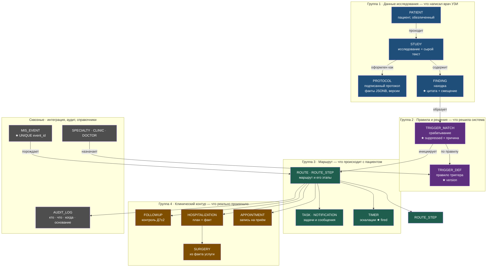
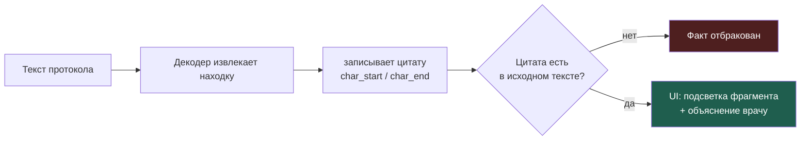

# Модель данных

> [!info] Статус документа
> Реализовано и проверено миграцией `e18a439f9a84` (21 таблица, 54 индекса,
> 3 типа enum, 21 constraint). Схема применяется командой `alembic upgrade head`.

Связано: [Архитектура](architecture.md) · [API](api.md) · [Матрица маршрутизации](routing-matrix.md)

---

## 1. Зачем такая схема

В системе три разных вопроса к данным, и их важно не смешивать:

1. **Что написал врач** — текст протокола, находки, цитаты.
2. **Что из этого решила система** — сработавшие и подавленные триггеры с причинами.
3. **Что происходит с пациентом дальше** — маршрут, этапы, таймеры, задачи.

Если смешать первые две группы, получится таблица «находка со статусом», в
которой невозможно ни объяснить решение, ни посчитать метрику ложных
срабатываний. Разделение — не формальность, а условие измеримости.

---

## 2. Группы сущностей



| Группа | Отвечает на вопрос | Ключевая сущность |
|--------|-------------------|-------------------|
| 1. Исследование | Что написал врач УЗИ | `FINDING` — с цитатой |
| 2. Решения | Что система извлекла и как решила | `TRIGGER_MATCH` — с `suppressed` |
| 3. Маршрут | Что происходит с пациентом | `ROUTE` + `TIMER` |
| 4. Клинический контур | Что реально произошло | `SURGERY`, `FOLLOWUP` |
| 5. Сквозные | Интеграция и аудит | `MIS_EVENT`, `AUDIT_LOG` |

Поток данных: **группа 1 → 2 → 3 → 4**. Исключение — `MIS_EVENT` может
породить `ROUTE` напрямую: событие о визите или госпитализации приходит без
нового протокола.

---

## 3. Таблицы

| Таблица | Что хранит | Ключевые поля |
|---------|-----------|---------------|
| `patient` | Обезличенного пациента | `external_id`, `anonymized_hash`, `age`, `sex` |
| `study` | Исследование и его текст | `study_type`, `study_date`, `raw_text`, `status` |
| `protocol` | Подписанный протокол | `signed_at`, `facts` JSONB, `is_corrected`, `is_cancelled` |
| `finding` | Извлечённая находка | `finding`, `organ`, `size_mm`, **`quote`**, `char_start`, `char_end`, `in_negative_ctx` |
| `trigger_def` | Правило триггера из матрицы | `synonyms`, `negative_contexts`, `thresholds`, `specialty`, `target_sla_days`, `priority`, `emergency_flag`, **`version`** |
| `trigger_match` | Решение по триггеру | `fired`, **`suppressed`**, **`suppression_reason`**, `applied_rule`, `explanation` |
| `route` | Маршрут пациента | `status` (19 значений), `specialty_id`, `clinic_id`, `target_date`, `close_reason` |
| `route_step` | Этапы маршрута | `step_no`, `status`, `entered_at`, `due_at` |
| `timer` | Таймеры эскалаций | `timer_type` (6 значений), `due_at`, `fired`, `fired_at` |
| `task` | Задачи персоналу | `task_type`, `assignee_role`, `due_at`, `priority`, `status` |
| `notification` | Отправленные сообщения | `channel`, `template_code`, `body`, `delivery_status` |
| `appointment` | Запись на приём | `doctor_id`, `clinic_id`, `starts_at`, `visit_status`, `is_online` |
| `hospitalization` | Госпитализация | `scheduled_date`, `actual_date`, `ward`, `status` |
| `surgery` | Операция | `service_code`, `performed_at` |
| `followup` | Контрольный визит | `target_date`, `status` |
| `audit_log` | Журнал действий | `actor`, `action`, `basis`, `details` JSONB |
| `mis_event` | Входящие события МИС | **`event_id` UNIQUE**, `event_type`, `payload`, `is_duplicate` |
| `specialty` | Справочник специальностей | `code`, `name`, `is_surgical` |
| `clinic` | Справочник площадок | `code`, `name`, `address` |
| `doctor` | Справочник врачей | `external_id`, `full_name`, `specialty_id`, `clinic_id` |

---

## 4. Идемпотентность: почему не будет дублей

Требование кейса: «Повторная доставка одного события не должна создавать
дубли». Реализовано четырьмя уникальными ограничениями — каждое закрывает
свой сценарий повторов.

| Ограничение | Что блокирует | Сценарий |
|-------------|---------------|----------|
| `mis_event.event_id` UNIQUE | Повторная доставка события МИС | МИС переотправил `StudyProtocolSigned` |
| `uq_trigger_match_protocol_trigger` (`protocol_id`, `trigger_def_id`) | Второй триггер того же типа на том же протоколе | Исправление протокола → пересчёт триггеров |
| `uq_route_trigger_match` (`route.trigger_match_id`) | Второй маршрут от одного срабатывания | Повторный `StudyProtocolSigned` после таймаута |
| `uq_timer_route_type_due` (`route_id`, `timer_type`, `due_at`) | Два одинаковых таймера | Пересоздание таймеров при пересчёте маршрута |

Все четыре проверены тестами на живой БД: повторная вставка блокируется
на уровне СУБД, а не логикой приложения.

Дополнительно `timer.fired` защищает от двойного срабатывания таймера —
это уже не дубль в данных, а повторное действие.

---

## 5. Критические поля

### `finding.quote` — цитата-доказательство



Без цитаты невозможно ни показать врачу основание решения, ни защититься от
галлюцинаций LLM: факт, на который нельзя сослаться, отбрасывается на
входе. Проверка — в `Finding.__post_init__` и в контрактных тестах.

### `trigger_match.suppressed` + `suppression_reason` — объяснение нормы

Требование кейса: «Для нормы — **почему** триггер не сработал, например
из-за отрицания». Без этих полей нельзя измерить целевую метрику «ложные
срабатывания на нормах ≤ 0,05»: система не сможет отличить «нашла и
объяснила» от «нашла наугад».

| Причина | Когда |
|---------|-------|
| `negative_context` | Находка в отрицании («полипа не выявлено») |
| `threshold_not_met` | Размер ниже порога |
| `study_type_mismatch` | Триггер не для этого вида исследования |
| `no_match` | Ни один синоним не встретился |

### `trigger_def.version` — версия правила

В объяснимости видно `endometrial_polyp@v1`. Поменяли порог — новая версия
видна в старых маршрутах: видно, по какой редакции было принято решение.

---

## 6. Частичные индексы

Три индекса построены с условием `WHERE` — они работают только на
подмножестве строк и экономят место, не теряя скорости.

| Индекс | Условие | Что ускоряет |
|--------|---------|--------------|
| `idx_timer_due` | `WHERE NOT fired` | Выборка таймеров при прокрутке модельного времени: `Clock.advance()` за одну операцию |
| `idx_route_unfinished` | `WHERE closed_at IS NULL` | Баннер «Незавершённый клинический маршрут» и отчёт о потерях |
| `idx_mis_event_unprocessed` | `WHERE processed_at IS NULL` | Очередь необработанных событий МИС |

Проверено на живой БД: при `enable_seqscan=off` планировщик выбирает
`Bitmap Index Scan` по каждому из них.

---

## 7. Модель времени в схеме

Все даты — `TIMESTAMP WITH TIME ZONE`. Источник времени в приложении один:
`app/clock.py`. Прямые вызовы `datetime.now()` в доменной логике
запрещены — иначе модельное время (прокрутка 30 дней за секунды) не
работает, а это ключевое требование кейса.

`Timer.due_at` рассчитывается от `route.created_at` или от конкретного
события (выписка, неявка) — но всегда через `Clock`, поэтому на демонстрации
сценарий «не записался за 30 дней» отрабатывает мгновенно.

---

## 8. Типы enum

| Тип | Значений | Назначение |
|-----|----------|-----------|
| `route_status` | 19 | Состояние автомата маршрута |
| `close_reason` | 6 | Почему маршрут закрыт (для отчёта о потерях) |
| `timer_type` | 6 | Тип таймера эскалации |

Нативные PostgreSQL enum, а не строки с CHECK: БД сама отвергает
недопустимое значение (`invalid input value for enum route_status`),
а не полагается на дисциплину приложения.

---

## 9. Проверка схемы

```bash
# применить
alembic upgrade head

# убедиться, что схема совпадает с моделями (autogenerate не найдёт расхождений)
alembic check
# → No new upgrade operations detected

# обратимость: downgrade откатывает и таблицы, и enum-типы
alembic downgrade base && alembic upgrade head
```

> [!warning] Частая ошибка
> Alembic не удаляет PG-enum-типы при `drop_table`. Без явного `DROP TYPE`
> в `downgrade()` повторный `upgrade` падает с `DuplicateObjectError`.
> Это уже исправлено в миграции — но важно помнить при добавлении новых.